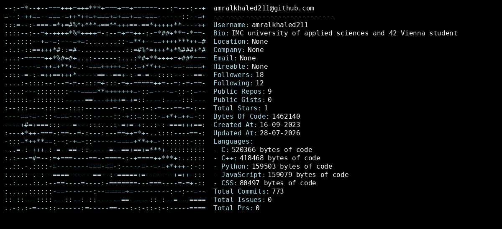

<h1 align="center">Hi, I'm Amr 👋</h1> <h3 align="center">Computer Science student in Vienna, building things from the ground up</h3> <!-- Neofetch-style stats image generated by readmefetch (github.com/pruefsumme/readmefetch). Once you've forked that repo as amralkhaled211/amralkhaled211 and run the Action, it will drop/update an image at out/fetch.png in that repo — swap the src below to point at it, e.g.: https://raw.githubusercontent.com/amralkhaled211/amralkhaled211/main/out/fetch.png --> 
  
 
    

About me
🎓 Studying Computer Science at IMC Krems (databases, networking, applied mathematics, programming)
⚙️ Two years at 42 Vienna, a peer-to-peer coding school with no teachers — heavy on low-level, from-scratch systems programming
🔭 Currently building ArcadeHub, a full-stack web app with a Python backend and SQL database
🌱 Comfortable moving between low-level C/C++ and higher-level Python
📫 Reach me via GitHub
Pinned projects
Project	What it is	Stack
ArcadeHub	Full-stack web app — Python backend, SQL database	Python
Webserv	An HTTP server, written from scratch	C++
minishell	A Bash replica shell — parsing, execution, redirections	C
cub3D	Raycasting 3D engine, Wolfenstein-style renderer	C
cpp	Modules building up strong C++ / OOP fundamentals	C++
Tech I work with

       

Areas I've worked in: Unix shells, HTTP servers, concurrency & threading, socket programming, raycasting/3D rendering, image processing (numpy, PIL/matplotlib), OOP design patterns, networking fundamentals (OSI, TCP/UDP, subnetting).

GitHub stats

   
 
  

<i>Currently deep in databases, networking, and applied mathematics coursework — always shipping something on the side.</i>

## Example Output

  

